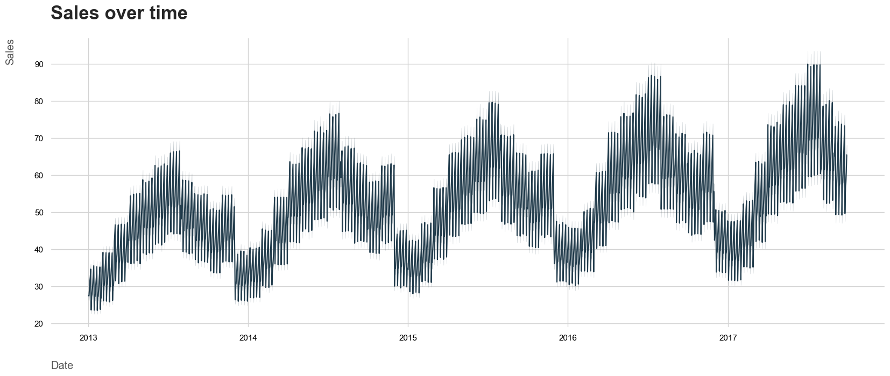
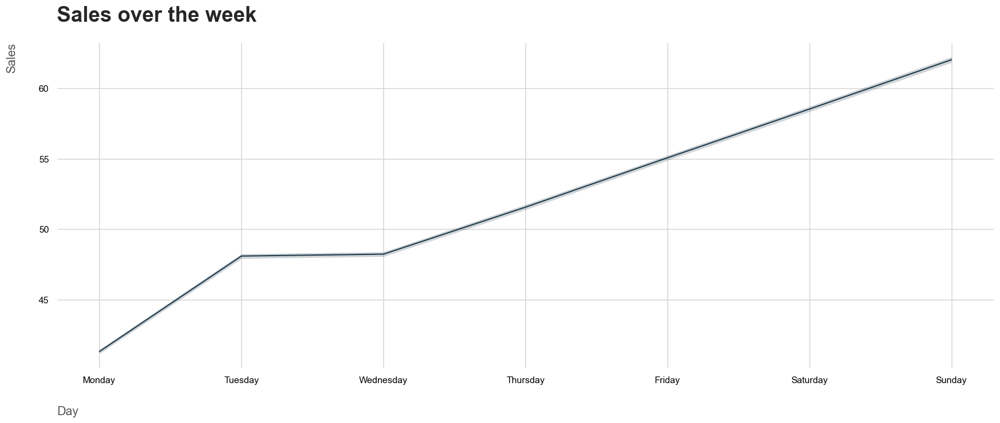
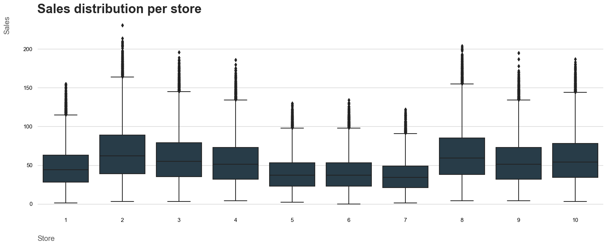
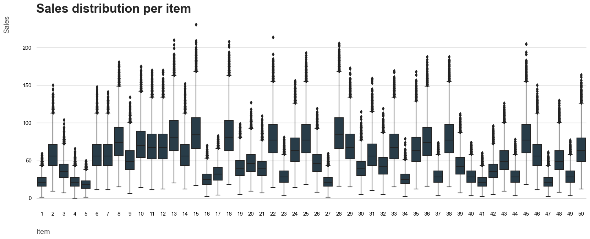
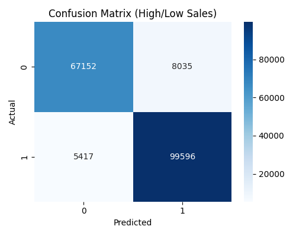
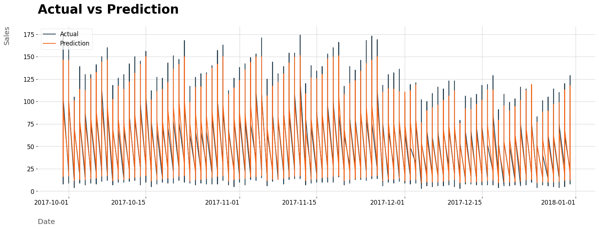
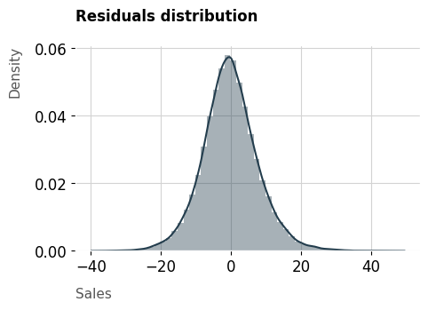
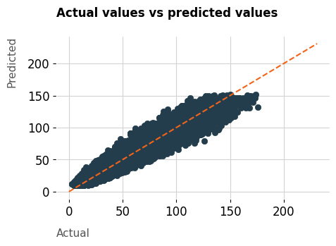
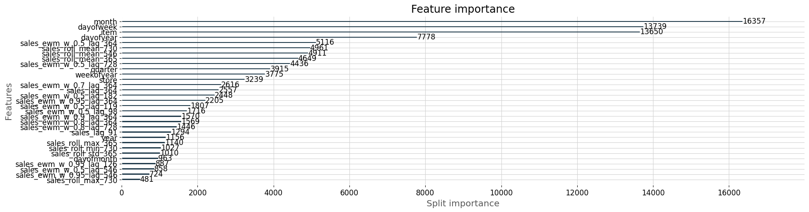

# Demand Intelligence & Inventory Optimization System

## Executive Summary
I built an end-to-end demand intelligence and inventory optimization system that forecasts demand, simulates risk scenarios, and automatically recommends reorder decisions to minimize stockouts and holding costs. This system is designed for real-world retail/quick-commerce operations (e.g., Blinkit) and is industry-ready.

---

## Key Capabilities
- **Probabilistic Forecasts:** Predicts not just demand, but confidence intervals, best/worst-case, and volatility for every SKU/store/date.
- **Cost-Based Optimization:** Decision engine recommends optimal order quantities, considering lead time, storage, expiry, and cost/risk tradeoffs.
- **Scenario Simulation:** Simulates business events (festivals, rain, supply delays) and quantifies impact on stock, revenue, and wastage.
- **Segmentation Intelligence:** Custom logic for fast/slow/premium/essential SKUs, each with tailored models and safety stock.
- **Real-Time Updates:** System ingests new sales hourly, updates forecasts, and self-corrects reorder plans.
- **Monitoring & Alerts:** Tracks forecast error, missed peaks, overstock, lost revenue; triggers retrain/alert on drift.
- **Business KPIs:** Reports stockout rate, inventory turnover, revenue protection, cost savings, and service level.
- **Explainability:** Surfaces key drivers for demand spikes, changes vs last week, and feature importances for trust.
- **Governance:** Includes data validation, model versioning, rollback, and audit logs for enterprise reliability.

---

## Technologies Used
- Python (Pandas, Numpy, Scikit-Learn, LightGBM, Optuna, Statsmodels, Matplotlib, Seaborn)
- Jupyter Notebook
- Git, Anaconda, VS Code.

## Project Structure
- input/: Data
- models/: Model artifacts
- notebooks/: EDA, modelling, simulation
- reports/: Visuals, metrics, scenario results
- src/: All code (feature engineering, forecasting, optimization, monitoring, explainability)
- requirements.txt, setup.py, README.md

## What This System Solves
- What will sell? (SKU/store/date forecasts)
- Where will it sell? (Store-level granularity)
- When will it spike? (Event/seasonality detection)
- How confident are we? (Uncertainty, risk bands)
- What should we do? (Order recommendations)
- How much money will this save? (Cost/revenue impact)

## System Pipeline
1. Forecasting (robust, leakage-free, validated)
2. Uncertainty & Risk (confidence bands, volatility)
3. Decision Optimization (cost-based, multi-constraint)
4. Scenario Simulation (business event impact)
5. Segmentation (SKU/store logic)
6. Real-Time Updates (self-correcting)
7. Monitoring & Alerts (MLOps)
8. Business KPIs (CXO reporting)
9. Explainability (feature drivers)
10. Governance (validation, versioning, rollback)

## Example Insights & Visuals
- Demand trends, seasonality, and spikes
- Top/worst stores and SKUs
- Scenario impact (e.g., festival, rain, delay)
- Optimization results (cost/revenue)

## Metrics & Monitoring
- Regression: MAE, RMSE, R2, MAPE
- Classification: Confusion Matrix, Accuracy, Precision, Recall
- Cost/revenue impact, stockout rate, inventory turnover
- Monitoring: error, drift, alerts, retrain triggers

## Example Optimization Output
| Store | Order Today | Order Tomorrow | Cost Saved | Stockout Risk |
|-------|-------------|---------------|------------|---------------|
| 1     | 85          | 40            | ₹12,000    | Low           |
| ...   | ...         | ...           | ...        | ...           |

## Scenario Simulation Example
| Scenario         | Revenue Loss | Wastage | Actionable Insight         |
|------------------|--------------|---------|---------------------------|
| Festival Surge   | ₹50,000      | Low     | Pre-stock essentials      |
| Supplier Delay   | ₹20,000      | Medium  | Increase safety stock     |

git clone https://github.com/allmeidaapedro/Store-Item-Demand-Forecasting.git
cd Store-Item-Demand-Forecasting
python -m venv venv
source venv/bin/activate  # On Windows, use 'venv\Scripts\activate'
pip install -r requirements.txt
jupyter notebook
deactivate

## How to Run
1. Clone repo
2. Create and activate virtual environment
3. Install requirements
4. Run Jupyter and open notebooks/
5. Explore code, scenarios, and optimization outputs

## Dataset
Source: [Kaggle Demand Forecasting Competition](https://www.kaggle.com/competitions/demand-forecasting-kernels-only/overview)

## Contact
- GitHub: [sarcasticpanda](https://github.com/sarcasticpanda)
- Email: saubhagyakashyap44@gmail.com
